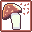

!!! abstract "Subclass Information"

    {: style="image-rendering: pixelated; width: 32px;" }

    *Type: Hybrid Spell Caster*

    The Druid is a hybrid spell caster capable of direct damage, damage over time,  healing, healing over time, and slowing enemy movement speed. 
    This is the starting Class for the Fey.  
    
    
## Spell Lines

!!! info "Spell Line - Chloroplast"

    {: style="image-rendering: pixelated; width: 32px;" }
     
    A healing over time spell that heals any allies within the spell area for a short duration.  Advanced versions of the base spell are purchased from the Druid Lore Master.
    
    | Spell Name | Level | Mana | Ticks | Damage |
    | :---: | :---: | :---: | :---: | :---: |
    | Chloroplast | 1 | ? | ? | ? | ? |
    | Phytosynthesis | 4 | ? | ? | ? | ? |
    | Heartvine Infusion | 8 | ? | ? | ? | ? |
    | Fungal Regrowth | 25 | ? | ? | ? | ? |
    | Crystalline Bloom | 35 | ? | ? | ? | ? |
    | Sunlight Infusion | 45 | ? | ? | ? | ? |

 
!!! info "Spell Line - Vinelash "

    {: style="image-rendering: pixelated; width: 32px;" }

    A debuff spell, that slows enemy movement in an area of effect.  One of the starting spells for the Fey Faction.  Spell tome can be purchased from the Druid Lore Master in Lyrinta.

    | Spell Name | Level | Mana | Ticks | Damage |
    | :---: | :---: | :---: | :---: | :---: |
    | Vinelash | 1 | ? | ? | ? | ? |
    | Frost Tangle | 4 | ? | ? | ? | ? |
    | Shadow Roots | 8 | ? | ? | ? | ? |
    | Heartvine Creepers | 25 | ? | ? | ? | ? |
    | Devouring Roots| 35 | ? | ? | ? | ? |
 
!!! info "Spell Line - Minor Healing "

    {: style="image-rendering: pixelated; width: 32px;" }

    A instant heal, that recovers a portion of your HP.

    | Spell Name | Level | Mana | Ticks | Damage |
    | :---: | :---: | :---: | :---: | :---: |
    | Minor Healing | 5 | ? | ? | ? | ? |
    | Healing | 10 | ? | ? | ? | ? |
    | Earthen Renewal | 17 | ? | ? | ? | ? |
    | Replenishment of the Grove | 25 | ? | ? | ? | ? |
    | Heartvine Infusion | 40 | ? | ? | ? | ? |
    | Intervention of the Goddess | 50 | ? | ? | ? | ? |
    
!!! info "Spell Line - Sporecloud "

    {: style="image-rendering: pixelated; width: 32px;" }

    A damage over time spell, providing SV_DECAY based damage.  Spell tome can be purchased from the Druid loremaster in Lyrinta.  Ancient location is unknown.

    | Spell Name | Level | Mana | Ticks | Damage |
    | :---: | :---: | :---: | :---: | :---: |
    | Sporecloud | 2 | ? | ? | ? | ? |
    | Blackcap Cloud | 5 | ? | ? | ? | ? |
    | Destroying Angel Cloud | 13 | ? | ? | ? | ? |
    | Funeral Bell Cloud | 20 | ? | ? | ? | ? |
    | Panthercap Cloud | 30 | ? | ? | ? | ? |
    | Ancient: Doomcap Cloud | 40 | ? | ? | ? | ? |
    
!!! info "Spell Line - Lightning Strike "

    {: style="image-rendering: pixelated; width: 32px;" }

    A direct damage spell, dealing SV_ELEMENTAL damage to enemies in an AOE.  Spell tome can be purchased from the Druid lore master in Lyrinta.  Ancient location unknown.

    | Spell Name | Level | Mana | Ticks | Damage |
    | :---: | :---: | :---: | :---: | :---: |
    | Lightning Strike | 1 | ? | ? | ? | ? |
    | Storm Caller | 7 | ? | ? | ? | ? |
    | Storm Channeler | 15 | ? | ? | ? | ? |
    | Concentrated Lightning | 25 | ? | ? | ? | ? |
    | Heat Lightning | 35 | ? | ? | ? | ? |
    | Cloudstrike| 50 | ? | ? | ? | ? |
    | Ancient: Stormrage | 50 | ? | ? | ? | ? |
    
## Description
The Druid is a hybrid spell caster.
